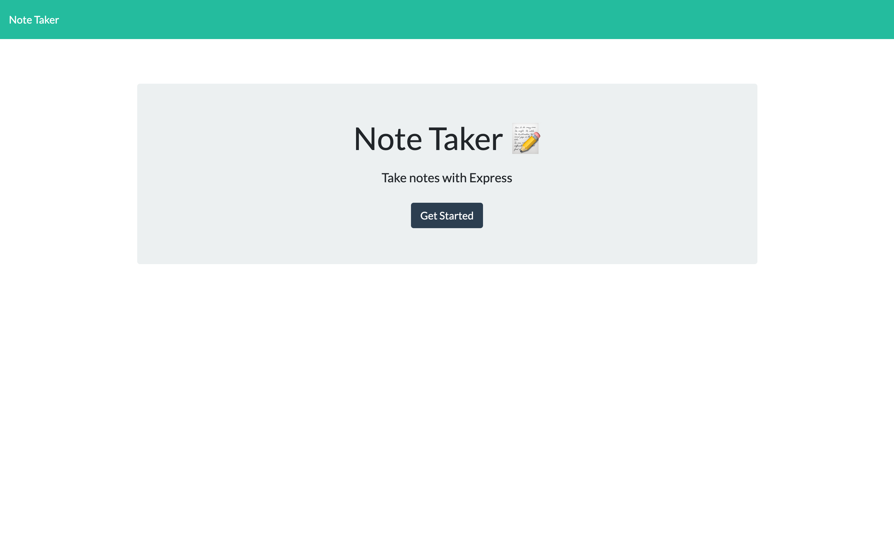
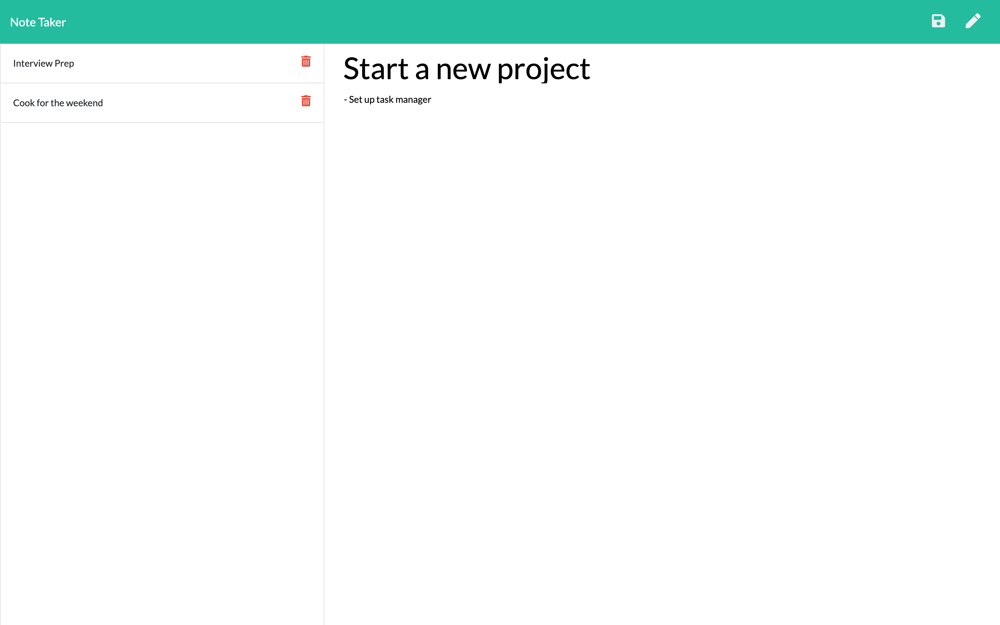

# Note Taker

## Need to take some quick notes on your computer?

Conveniently takes notes and save them. Come back and open the notes, edit them, or delete them.

## Technologies used

HTML - Bootstrap - CSS - Express - NodeJS - MySQL
